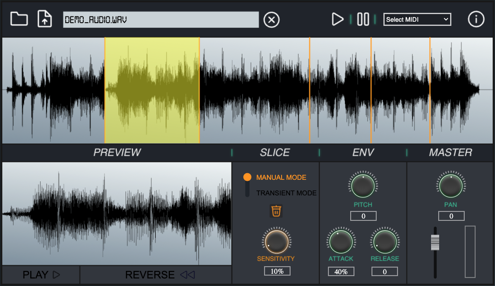

# Miracle Slicer 3
### [Miracle Slicer Site](https://stefano-morano.github.io/Miracle_Slicer_3.github.io/)

### [Demonstration Video](https://polimi365-my.sharepoint.com/:v:/g/personal/10741332_polimi_it/EZeLmGfp2ulHr0xiG7rqT-MBNgY7_huixZJ_FGWoy1lDew?nav=eyJyZWZlcnJhbEluZm8iOnsicmVmZXJyYWxBcHAiOiJPbmVEcml2ZUZvckJ1c2luZXNzIiwicmVmZXJyYWxBcHBQbGF0Zm9ybSI6IldlYiIsInJlZmVycmFsTW9kZSI6InZpZXciLCJyZWZlcnJhbFZpZXciOiJNeUZpbGVzTGlua0NvcHkifX0&e=t4Pnco)

## INTRODUCTION
Audio Slicer for the ACTAM project at Politecnico di Milano.
Made using HTML, CSS, JavaScript and the Tone.js library to manipulate the audio Buffer.
The graphic interface is designed ad hoc by using icons from the LordIcon database and knobs created entirely by us.

## TOOLS
HTML - to initialize the libraries and the objects inside the page.

CSS - to move and modify the aspect of the objects.

JavaScript - to manipulate functions through the use of the elements in the page.

[Tone.js](https://tonejs.github.io/) - to manipulate the audio notes.

[LordIcon.js](https://lordicon.com/) - to add animation for the icons.

## Implemented Functionality
| Functionality       | State |
|:--------------------|:-----:|
| Attack              |   ✅   |
| Release             |   ✅   |
| Manual Slicing      |   ✅   |
| Onset Detector      |   ✅   |
| Pan                 |   ✅   |
| Pitch               |   ✅   |
| Volume Slider       |   ✅   |
| Animation           |   ✅   |
| Decay/sustain       |   ❌   |
| Mic Rec             |   ❌   |
| Quantization        |   ❌   |

## INSTRUCTION

Choose the audio file by clicking the folder button and load it by clicking the button next to it.

Use the left mouse button to draw a slice and the right one to select regions. You can preview the selected slice and reverse it, also manipulating the attack and the release of the single region.

With the toggle switch set in TRANSIENT MODE, you can active the automatic onset recogniser and modify the threshold with the relative knob.

You can also change the pitch, the pan and the master volume of the song/audio.

When you have your slicer set up, you can play the loops with your computer keyboard or with a MIDI keyboard by choosing it via the drop-down menu in the top right corner.

## CHALLENGES ENCOUNTERED

### ONSET DETECTOR

Our most difficult challenge was to implement the adaptive threshold recognition that permits to find the transients in our song. Due to its complexity the tool requires a bit time to process all the audio buffer and to apply the DFT.

### KNOBS

Also challenging was the implentation of the knobs. They are entirely made in CSS with the glow and shadow effects. We were able to make them rotate with JavaScript. Every time the user rotates a knob, there's another JS function that links the knob to the relative value and it calculates the output through a range.

### VOLUME METER
There was a problem with the analysis of the instant volume of the audio player. We managed to read the value connecting the player node to a meter given by the Tone.js library. We implemented the function "drawMeter()" in the JavaScript, that extracts the volume value from the Meter and converts it to a CSS value for the animation.

## WARNING
You have to connect your midi keyboard before the use of Miracle Slicer 3: if you connect it while you are in the website, you have to refresh it.

## AUTHORS 
Stefano Morano

Andrea Arosio

Marco Roncoroni

ACTAM course by Prof. Francesco Bruschi

